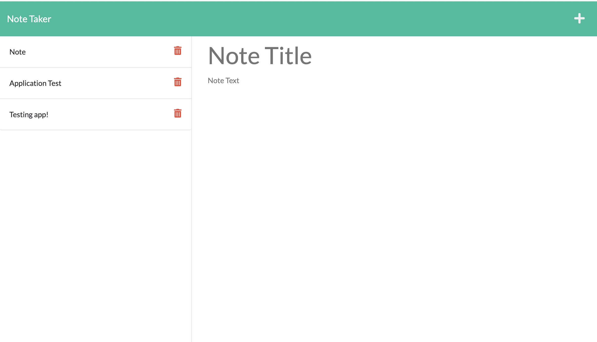

# note-taker-application

## Description

I created this project so that a user would be able to write, save, and delete multiple notes. This will help a user stay organized and on track of tasks that are needed to be completed. A user can reorganize the notes and also delete which ones they either finished or are no longer applicable. When a user clicks on the link to the notes page they are presented with their saved notes on the left hand side (titles) and a new note section on the right-hand column. A user inserts a title and text to their desired length (up to 500 characters). I learnt a lot about express.js and using GET/POST requests as well as different routes. I also learnt a lot about JSON and insomnia while building this application. I was also able to add the DELETE route so a user can delete a note they no longer want.

## Installation

This project uses node.js, express.js, and stores notes with a unique id (uuid npm package) in a JSON file.

## Usage

Start app by running npm start.
Below is a screenshot example of deployed app.

## Credits

Github: https://github.com/fcarroll12/note-taker-application
Heroku: https://git.heroku.com/mysterious-reef-20604.git
Regarding Heroku, I am having troubles. Please check back later once bugs are resolved.
